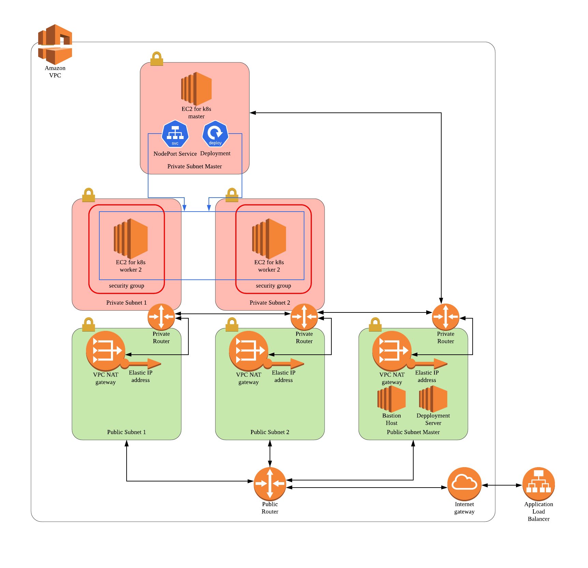

# uc-k8s-cluster [](https://app.circleci.com/pipelines/github/dev-daeun/udacity-capstone)


## How to deploy AWS resources for k8s cluster

**prerequisite**
* AWS profile whose default region is `us-west-2`.
* EC2 key-pair whose name is `udacity-capstone`.
```
$ cd infra/cloudformation
$ sh create_stack.sh uc-network resources/network.yml parameters/cidr.json
$ sh create_stack.sh uc-gateway resources/gateway.yml parameters/service_name.json
$ sh create_stack.sh uc-router resources/router.yml parameters/service_name.json
$ sh create_stack.sh uc-security-group resources/security_group.yml parameters/service_name.json
$ sh create_stack.sh uc-load-balancer resources/load_balancer.yml parameters/service_name.json
$ sh create_stack.sh uc-instance resources/instance.yml parameters/service_name.json
```


## Infrastructure



## CI & CD 


#### CI workflow in CircleCi
1. Lint Python code
2. Lint Dockerfile
3. Execute unit tests

#### CD workflow using Helm
1. Build and push docker image whose version is in the branch which passed CI workflow.
```
$ docker build -t flask-gunicorn -f docker/app/Dockerfile .
$ docker tag flask-gunicorn kde6260/flask-gunicorn:<new-version>
$ docker push kde6260/image:<new-version>
```

2. access Helm server via SSH.
```
$ ssh ubuntu@54.148.201.124:22 -i udacity-capstone.pem
```

3. Upgrade Helm release using command below.
```
helm upgrade -f helm-chart/values.yaml --repo chartmuseum --set deployment.flaskGunicorn.image=kde6260/flask-gunicorn:<new-version> my-helm-chart ./helm-chart
```

### Reference
* [Install a Kubernetes cluster on AWS using kops](https://kubernetes.io/docs/setup/production-environment/tools/kops/)
* [The simplest guide to using Blue/Green deployment in k8s](https://codefresh.io/kubernetes-tutorial/blue-green-deploy/)
* [Fully automated blue/green deployments in k8s with Codefresh](https://codefresh.io/kubernetes-tutorial/fully-automated-blue-green-deployments-kubernetes-codefresh/)
* [Kubernetes components](https://kubernetes.io/docs/concepts/overview/components/)
* [Nginx Upstream 성능최적화](https://brunch.co.kr/@alden/11)
* [Nginx config 정리](http://bong8nim.com/post/programming/etc/nginx-config-manual/)
* [Nginx full example](https://www.nginx.com/resources/wiki/start/topics/examples/full/)
